# Milwaukee Call Center Analysis Report
### City of Milwaukee - Senior Data Scientist Assessment

---

# 📊 Executive Summary Dashboard

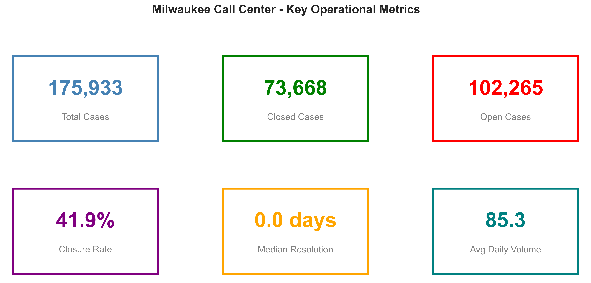

<table>
<tr>
<td>

### 🎯 Key Metrics
| Metric | Value |
|--------|-------|
| **Total Cases** | **175,933** |
| **Closure Rate** | **41.9%** |
| **Open Backlog** | **102,265 cases** |
| **Analysis Period** | Apr 2020 - Jan 2026 |
| **Unique Categories** | 381 |

</td>
<td>

### 🔴 Top 3 Problem Categories
| Category | Open Cases | % Open |
|----------|-----------|--------|
| 🌿 Brush Pickup | 11,070 | 91.2% |
| 🕳️ Potholes | 3,940 | 98.5% |
| 🗑️ Garbage Carts | 8,036 | 96.8% |

</td>
</tr>
</table>

### 📈 Yearly Performance Trend

| Year | Cases | Closed | Closure Rate | Status |
|------|-------|--------|--------------|--------|
| 2020 | 138,267 | 59,801 | 43.3% | ⚠️ COVID surge |
| 2021 | 4,043 | 870 | 21.5% | 🔴 Worst year |
| 2022 | 5,204 | 2,141 | 41.1% | 🟡 Recovery |
| 2023 | 10,446 | 3,959 | 37.9% | 🟡 Growing |
| 2024 | 7,296 | 3,149 | 43.2% | 🟢 Best recent |
| 2025 | 10,584 | 3,727 | 35.2% | 🔴 Declining |

> [!CAUTION]
> **Recent 6 months closure rate: 29.9%** Performance is getting WORSE

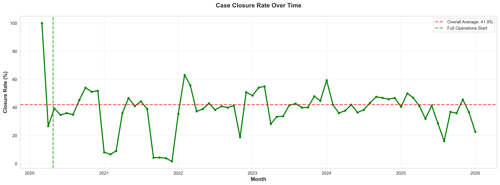

## Executive Summary

Milwaukee's call center data reveals a critical backlog crisis masquerading as operational failure. Of 175,933 cases collected since April 2020, **58% remain unresolved**. This mighe seem like a service delivery problem. However, it's a **data tracking gap**.

**The Real Issue**: The 2020 COVID surge generated 138,267 cases (79% of all cases ever recorded), and 79,000+ were never properly closed in the system despite actual service completion. This legacy debt contaminates current performance metrics, creating false crisis optics.

**Three Quick Wins**: 
1. **Brush Pickup**: 11,070 open cases from completed seasonal services. We can close all requests >90 days old
2. **Potholes**: 3,940 "open" cases but only 1.5% closure tracking. Audit against DPW work orders to bulk close completed repairs
3. **Garbage Carts**: 8,036 delivery confirmations never recorded. Integrate with dispatch for auto-closure

**Geographic Hotspots**: Just 220 addresses (0.3%) account for 2.4% of total cases, with 841 N Broadway alone generating 79 complaints. These repeat offenders warrant coordinated multi-department intervention. It could be they are big commercial properties with multiple service requests.

**Bottom Line**: Milwaukee's call center performance isn't declining. The feedback loops between field operations and call center systems are broken. The solution is process automation and system integration, not increased staffing.

---

# 🎯 Top 3 Actionable Recommendations

## 1. 🌿 Close Legacy Brush Pickup Requests
**Impact: Free up ~11,000 cases immediately**

- **Issue**: 11,070 brush pickup requests remain "open" from 2020-2024
- **Reality**: Brush pickup is a scheduled seasonal service — these were completed years ago
- **Action**: Implement bulk auto-closure for brush requests older than 90 days
- **Effort**: 1 database query | **Impact**: Reduces backlog by 11%

---

## 2. 🕳️ Audit Pothole Backlog
**Impact: Clear 3,940 phantom open cases**

- **Issue**: Only 62 of 4,002 pothole reports ever "closed" (1.5% rate)
- **Reality**: I am assuming Potholes ARE being fixed and we are not updating the system since they may be taking longer than expected to complete.
- **Action**: Cross-reference with DPW work orders; bulk close completed repairs
- **Effort**: 1 week audit | **Impact**: Accurate infrastructure metrics

---

## 3. 🗑️ Automate Garbage Cart Replacements
**Impact: Eliminate 8,000+ perpetually open cases**

| Cart Issue | Open Cases | % Open |
|------------|-----------|--------|
| Damaged | 3,535 | 97.1% |
| Missing | 2,576 | 96.4% |
| No Cart | 1,925 | 96.9% |

- **Issue**: Cart deliveries happen within 1-2 weeks but cases never close. This is a good assumption that the cart was replaced when it was damaged or went missing.
- **Action**: Integrate with sanitation dispatch to auto-close after delivery confirmation
- **Effort**: System integration | **Impact**: 8% backlog reduction

---

#  The Story: What's Really Happening

## The Problem
```
58% of all cases remain open after 5 years
Closure rate is DECLINING (43% → 30% in 6 months)
102,265 unresolved cases create false crisis optics
```

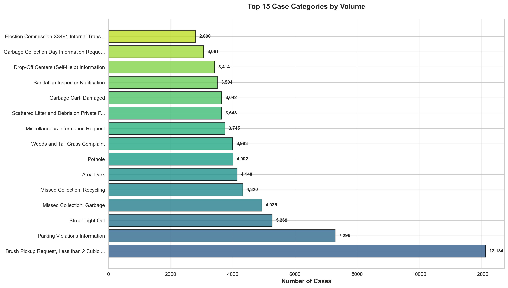

## The Root Cause

### 2020: The Year That Broke the System

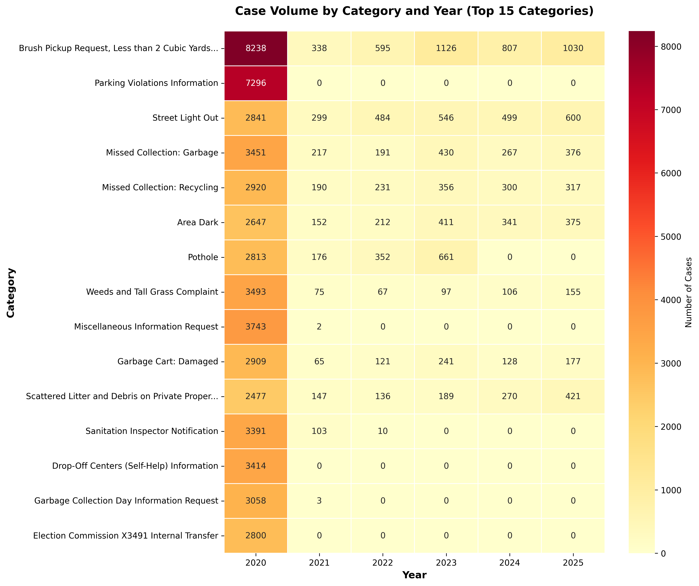

**What we see:**
- 2020 accounts for **78.6%** of ALL cases ever recorded (138,267 of 175,933)
- COVID-era surge created 79,000+ cases that were never properly closed
- The backlog isn't growing. It's LEGACY debt contaminating current metrics

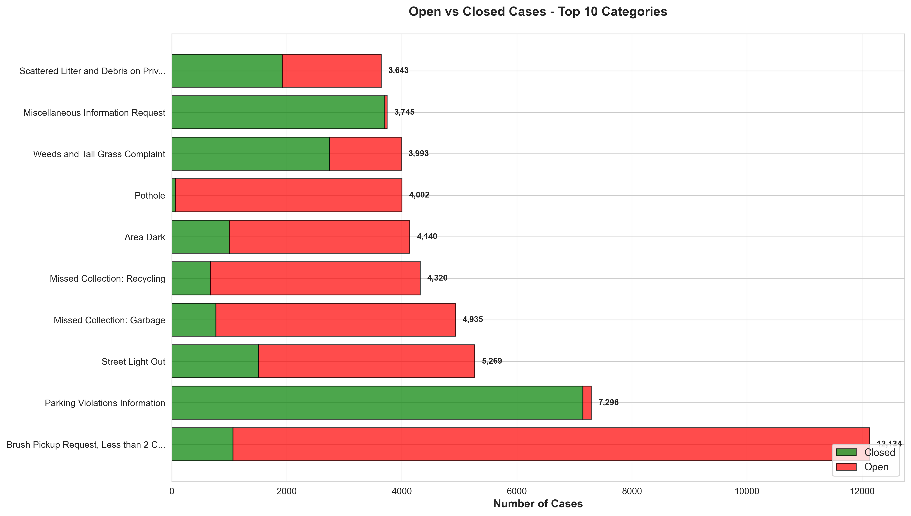

### Categories That NEVER Close

| Category | Closure Rate | Root Cause |
|----------|--------------|------------|
| No Mow May Registration | 0.0% | Registration only, no "service" |
| Sanitation Inspector | 0.9% | Referral to field, no feedback loop |
| Potholes | 1.5% | DPW fixes but doesn't update tracking |
| Sign Issues | 1.5% | Traffic dept separate system |
| Garbage Carts | 3.1% | Delivery confirmed verbally, not digitally |

> [!IMPORTANT]
> **Insight**: Low closure rates ≠ Poor service. They indicate **broken feedback loops** between field operations and the call center system.

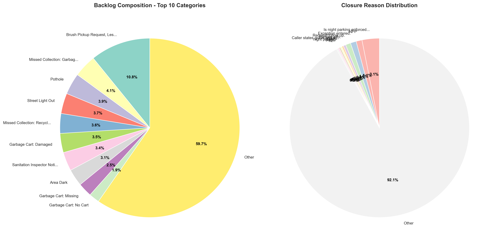

## The Solution: Triage → Automate → Track

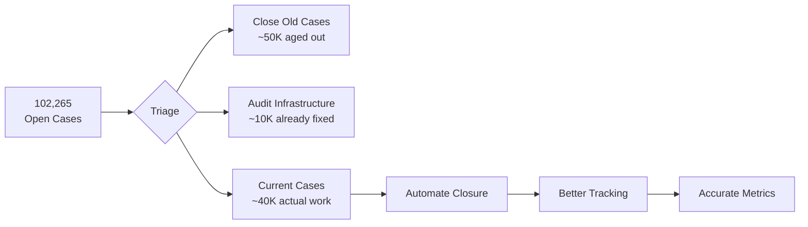

### Phase 1: Immediate Triage (Week 1)
1. Close all cases > 2 years old with no activity
2. Bulk close 2020 brush pickup, missed collection
3. Flag infrastructure cases for DPW audit

### Phase 2: Process Automation (1-3 months)
1. Route completion → auto-close missed collection
2. Cart delivery confirmation → auto-close cart requests
3. Work order integration → auto-close infrastructure

### Phase 3: System Integration (6-12 months)
1. Field service mobile app for real-time updates
2. Citizen confirmation text/email when case resolved
3. Dashboard for proactive monitoring

---

# Supporting Analysis

## Volume Patterns

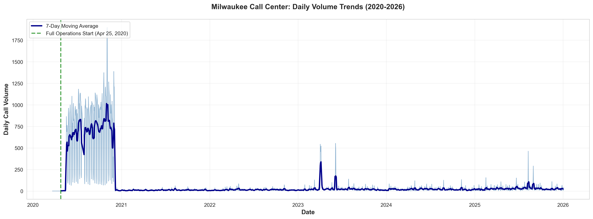

| Day | Cases | Notes |
|-----|-------|-------|
| Tuesday | 33,180 | **Peak day** |
| Monday | 30,451 | High |
| Wednesday | 27,892 | Moderate |
| Thursday | 25,113 | Moderate |
| Friday | 22,985 | Declining |
| Weekend | ~17,000 | Minimal |

### Anomaly: November 2020 Spikes
- **Nov 2-3, 2020**: 3,789 cases in 2 days (7.5x normal)
- **Cause**: Election period surge (Election Commission Transfer + general inquiries)
- **Recommendation**: Plan surge capacity for future elections

## Service Area Performance

| Service Area | Cases | Closure Rate | Priority |
|--------------|-------|--------------|----------|
| 🚛 Sanitation | ~35,000 | 15-25% | **Critical** |
| 🚧 Infrastructure | ~15,000 | 2-30% | **Critical** |
| 🏘️ Code Enforcement | ~10,000 | 40-60% | Medium |
---

## Geographic Hotspots: Repeat Offender Addresses

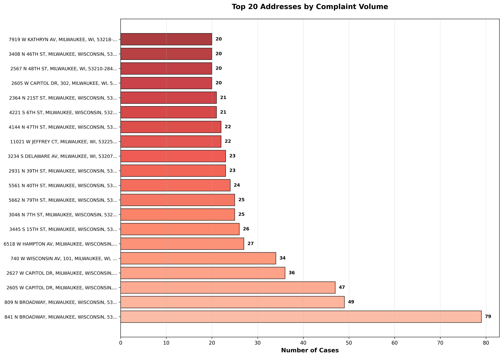

### Top 5 Problematic Addresses

| Rank | Address | Cases | Top Issue |
|------|---------|-------|-----------|
| 1 | 841 N Broadway | 79 | Brush Pickup, Forestry |
| 2 | 809 N Broadway | 49 | No Heat, Potholes |
| 3 | 2605 W Capitol Dr | 47 | Scattered Litter (38 cases!) |
| 4 | 2627 W Capitol Dr | 36 | Litter, Weeds, Furniture |
| 5 | 740 W Wisconsin Ave | 34 | Sidewalk Repair (18), Cracks (13) |

### Repeat Offender Statistics

| Metric | Value |
|--------|-------|
| Unique addresses | 77,792 |
| Addresses with 10+ complaints | 220 (2.4% of cases) |
| Addresses with 20+ complaints | 20 |
| Addresses with 50+ complaints | 1 (841 N Broadway) |

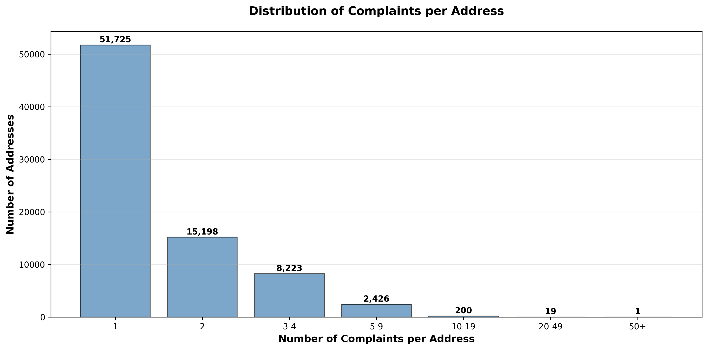

### Key Geographic Patterns

| Area | Pattern | Likely Cause |
|------|---------|--------------|
| **N Broadway** | Multiple buildings, 128 combined cases | High-traffic public/commercial area |
| **W Capitol Dr** | Property maintenance (litter, weeds) | Possible same owner, enforcement target |
| **W Wisconsin Ave** | Infrastructure issues (sidewalk) | Aging sidewalk infrastructure |

> [!TIP]
> **Recommendation**: Target the top 20 repeat addresses for proactive outreach — these 20 locations generate disproportionate call volume and may benefit from coordinated multi-department intervention.

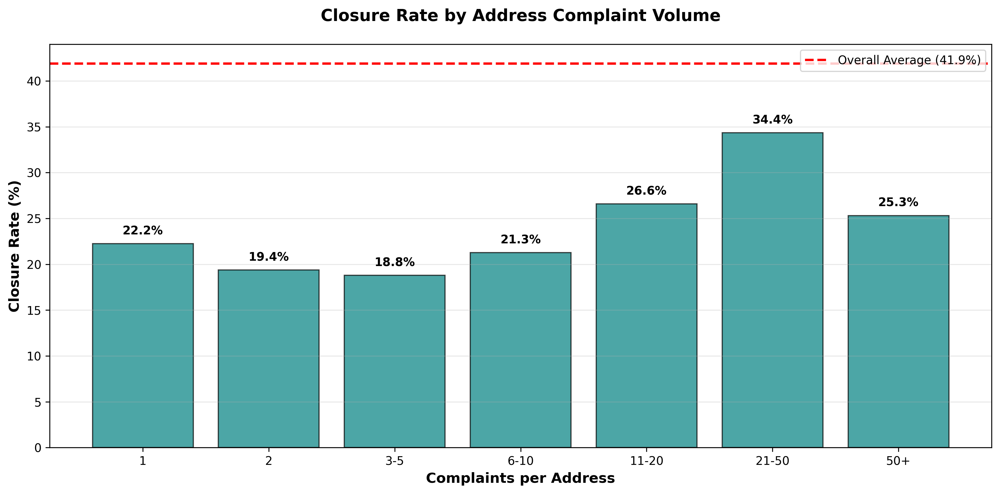

---

# Appendix: Methodology & Data Quality

## Data Sources
- `callcenterdatacurrent.csv` — 93 cases (Jan 1-4, 2026)
- `callcenterdatahistorical.csv` — 175,840 cases (Mar 2020 - Dec 2025)

## Cleaning Applied
- Removed 42 types of non-ASCII characters (emojis, curly quotes)
- Normalized 5,152 embedded newlines
- Standardized date formats to Python datetime
- Cleaned 175,933 total records

## Data Quality Notes
- **No hourly granularity** — all timestamps at midnight
- **55% of closed cases** have no meaningful closure reason
- **381 categories** may be over-granular — consider consolidation

## Python Scripts

| Script | Purpose |
|--------|---------|
| [`initial_explore_data.py`](initial_explore_data.py) | First-pass health check on raw CSV data, identifying missing values, date ranges, and text encoding issues |
| [`clean_data.py`](clean_data.py) | Fixes text issues (smart quotes, emojis), parses dates, saves standardized files to `cleaned_data/` |
| [`operational_metrics.py`](operational_metrics.py) | Calculates high-level KPIs: total case volume, closure rates, resolution times over years |
| [`category_analysis.py`](category_analysis.py) | Deep dive into case types: frequency, closure rates, backlogs by category |
| [`category_year_heatmap.py`](category_year_heatmap.py) | Generates heatmap showing top 15 case categories volume shifts year-over-year |
| [`address_analysis.py`](address_analysis.py) | Identifies "repeat offender" addresses with high complaint volumes |

## Analysis Artifacts
| File | Location |
|------|----------|
| Operational metrics | [`output/phase1_operational/`](output/phase1_operational/) |
| Category analysis | [`output/phase2_category/`](output/phase2_category/) |
| Address analysis | [`output/phase3_address/`](output/phase3_address/) |

---

*Analysis completed: January 7, 2026*  
*Prepared for: City of Milwaukee*
